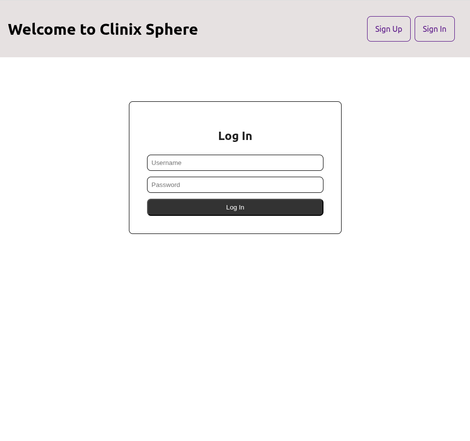
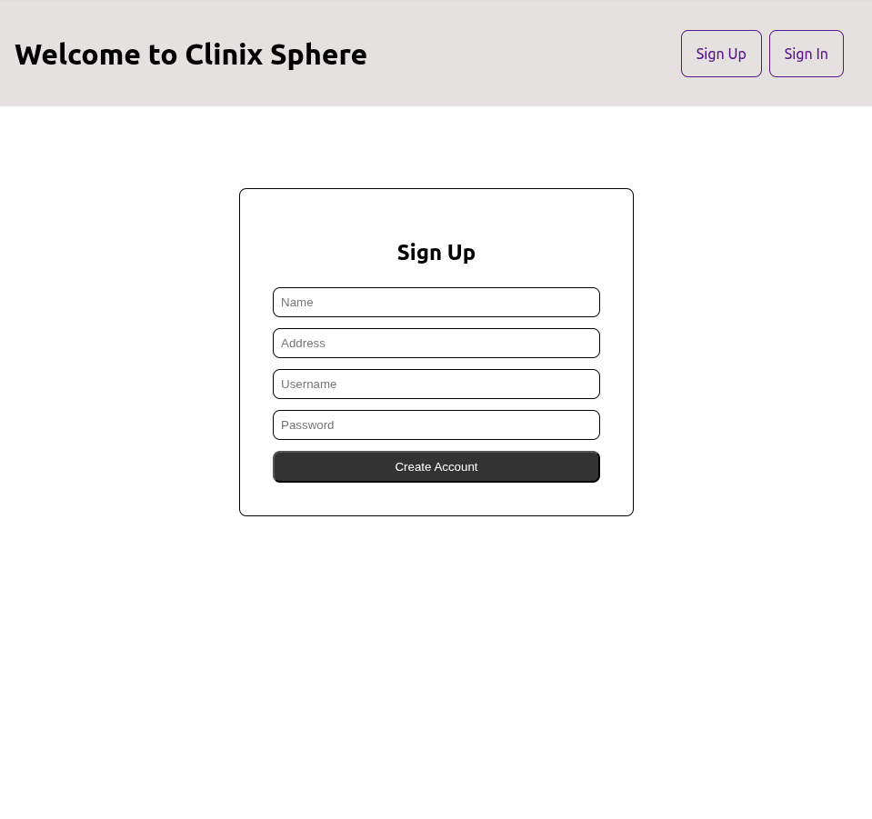
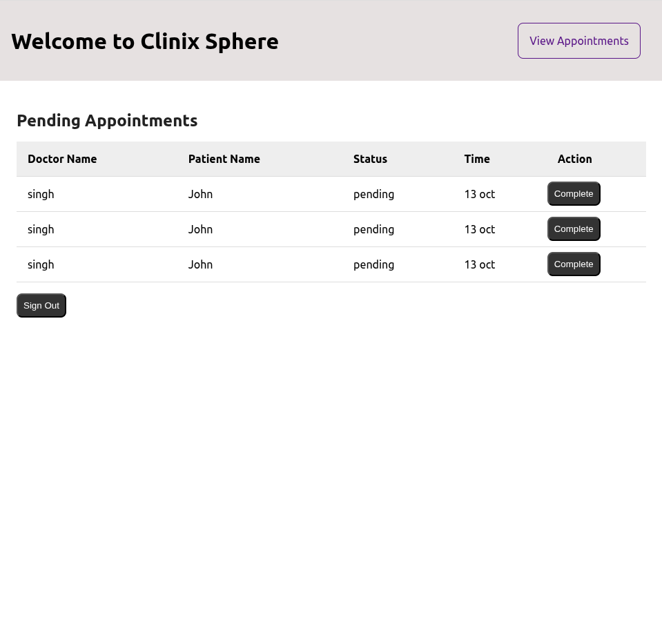
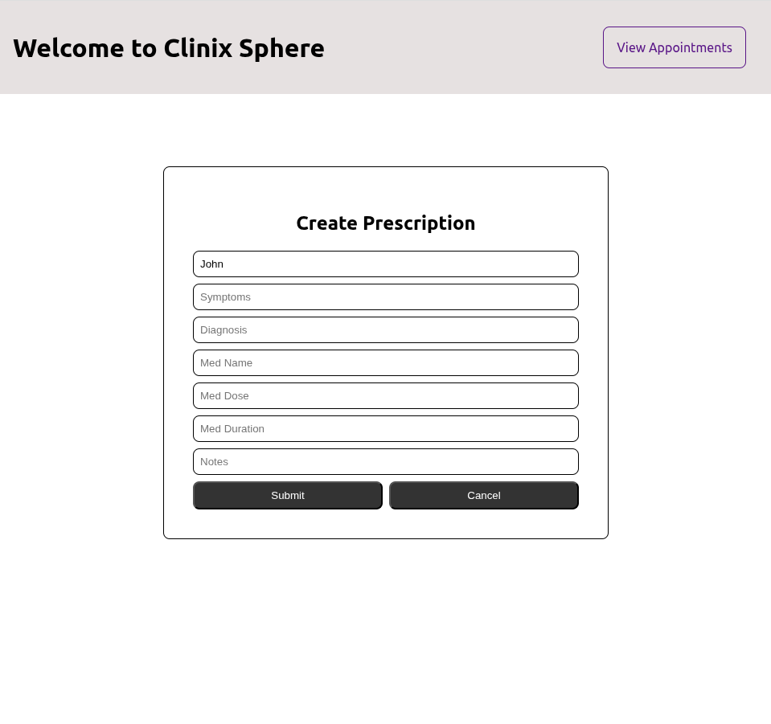
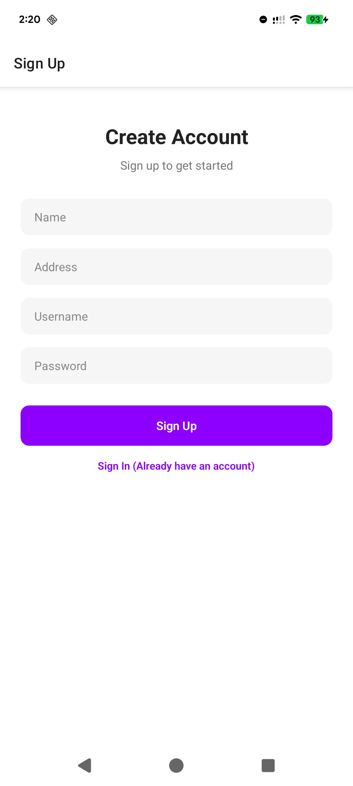
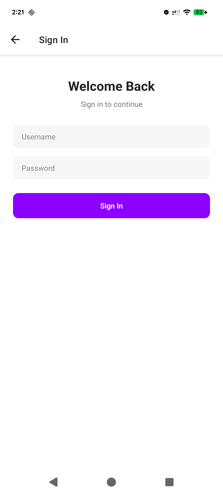
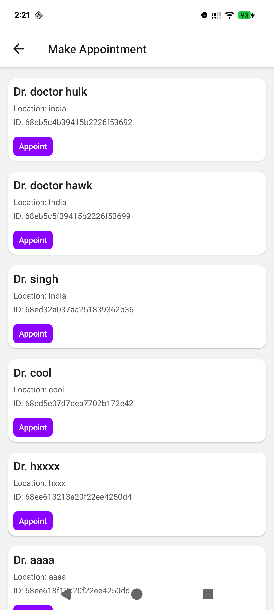
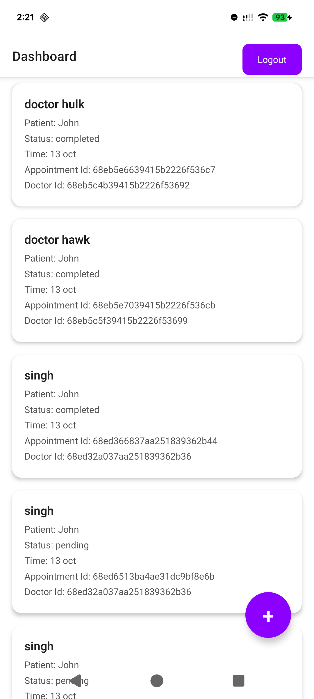
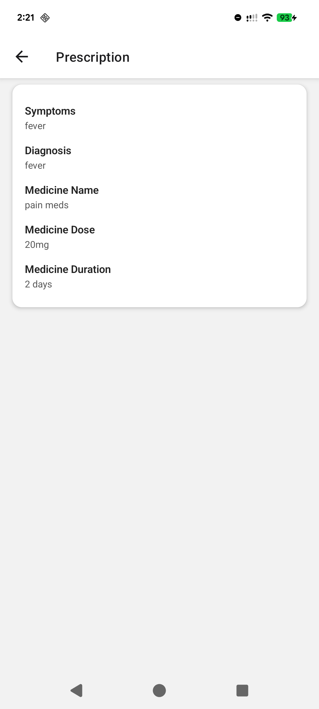

<h4>View Demo</h4>
https://drive.google.com/drive/u/0/folders/17qaYgy2qzacETGfkvKOCWs6-yT9mSTow

<h4>Deployed At</h4>
https://clinix-sphere-react-doctor-paramvir.vercel.app/

<h4>Running Locally</h4>
Navigate to the root directory.  
Run `npm install` in your terminal to download the required npm packages.  
Run `npm start` to start the React in your brower at http://localhost:3000/  

<h4>Sample Screenshots</h4>

